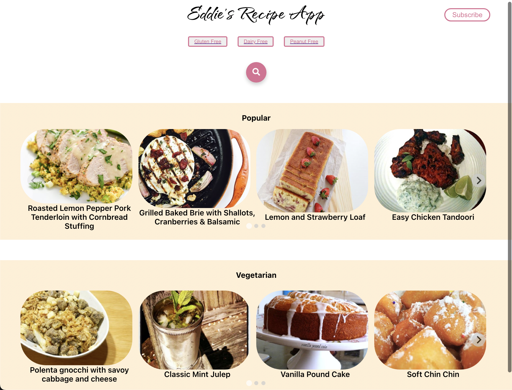
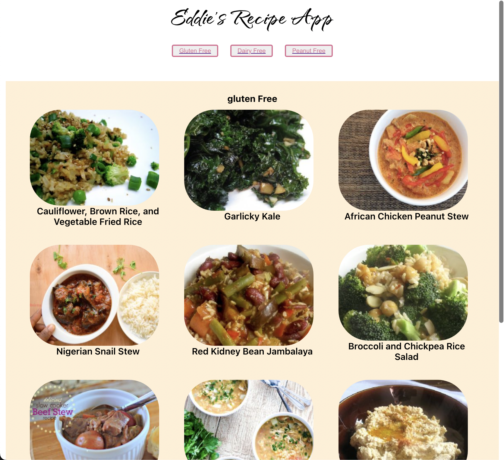
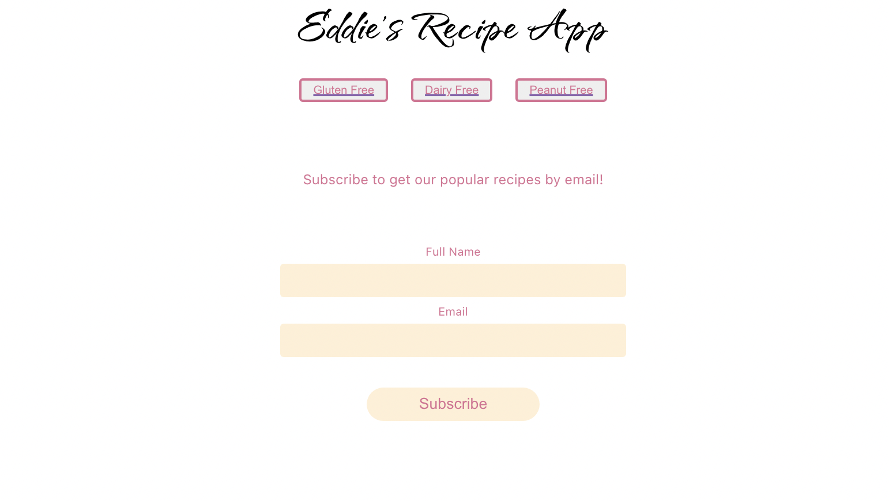

# Recipe App
### React Project

(last updated : 06/09/22)
### 💻 Used Stacks 💻

## used api 
* <a href="https://styled-components.com/">Styled</a>
* <a href="https://splidejs.com/integration/react-splide/">Splide</a>
* <a href="https://react-icons.github.io/react-icons">React Icons</a>

#### It looks Like : 
#### main page

#### option page

#### subscribe page

### 🗝 Key Skills 🗝
* Build a React single page application from scratch
* Apply knowledge of components, props and state management
* Incorporate client-side routing
* Use data from external APIs
* Persist data in a mock up backend